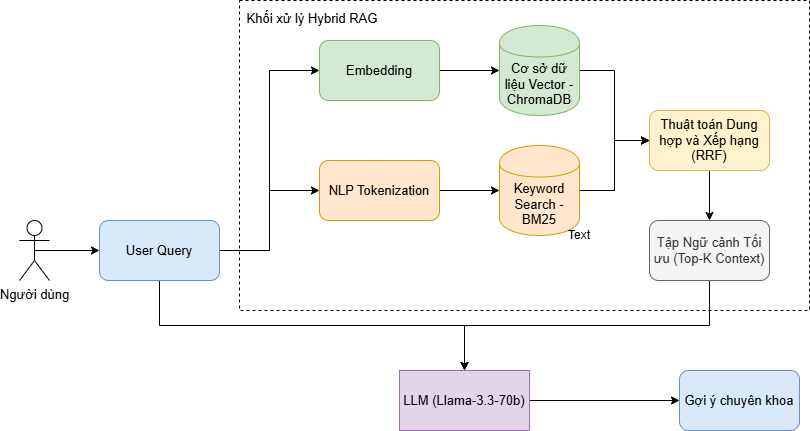
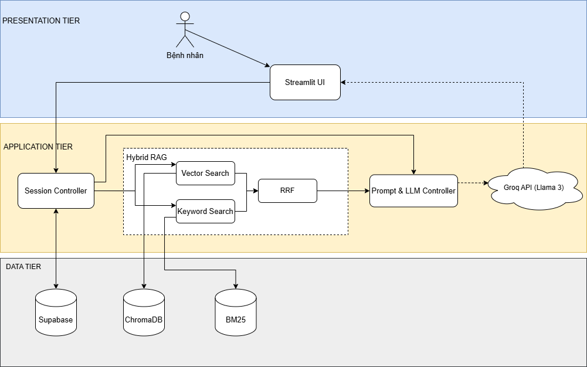

# 🏥 Health Chatbot AI

**Link truy cập:** [https://health-chatbot-tranhuutai.streamlit.app/](https://health-chatbot-tranhuutai.streamlit.app/)

**Tên dự án:** Trợ lý ảo (Health Chatbot) sàng lọc triệu chứng.

**Mục tiêu  của dự án:** Một chatbot hỏi người dùng về các triệu chứng hiện tại và đưa ra gợi ý họ nên đi khám ở chuyên khoa nào.

Dự án Chatbot tư vấn sức khỏe thông minh sử dụng kiến trúc **Hybrid RAG**.

## Kiến trúc Hệ thống (3 Trụ cột Công nghệ)

Hệ thống được thiết kế theo kiến trúc RAG, xây dựng dựa trên 3 trụ cột công nghệ cốt lõi nhằm đảm bảo tốc độ, độ chính xác và tính an toàn trong y tế:

### 1. High-Performance LLM (Mô hình Ngôn ngữ lớn tốc độ cao)
   * **Động cơ cốt lõi:** Sử dụng mô hình **Llama 3.3 70B Versatile** (`llama-3.3-70b-versatile`) thông qua nền tảng phần cứng LPU của **Groq API**. Sự kết hợp này mang lại khả năng suy luận logic xuất sắc và tốc độ sinh văn bản siêu tốc (gần như tức thì).
   * **Xử lý Ngôn ngữ Tự nhiên:** Hệ thống tập trung xử lý văn bản tiếng Việt để thấu hiểu chính xác tình trạng, triệu chứng bệnh mà người dùng mô tả thông qua ngôn ngữ đời thường.

### 2. Hybrid Search (Truy xuất thông tin lai)
   * **Vector Search (Tìm kiếm Ngữ nghĩa):** Sử dụng cơ sở dữ liệu **ChromaDB** để tìm kiếm theo ý nghĩa câu hỏi. Khắc phục điểm yếu của tìm kiếm truyền thống, giúp AI hiểu được triệu chứng kể cả khi người dùng không dùng từ chuyên môn y khoa.
   * **Keyword Search (Tìm kiếm Từ khóa):** Tích hợp thuật toán **BM25** kết hợp cùng bộ xử lý NLP Tiếng Việt (`underthesea`) để bắt chính xác các danh từ riêng, "từ khóa cứng" (tên thuốc, tên hội chứng đặc thù).
   * **RRF Fusion:** Hai luồng kết quả độc lập (Vector và BM25) được gộp lại và xếp hạng chéo bằng thuật toán **Reciprocal Rank Fusion (RRF)**. Điều này giúp cung cấp đoạn ngữ cảnh (Context) tối ưu và chính xác tuyệt đối cho AI trước khi sinh câu trả lời.

### 3. Medical Triage & Safety (Sàng lọc An toàn & Kiểm soát Ảo giác)
   * **Knowledge Base & Grounding:** Chỉ sử dụng dữ liệu y văn uy tín (MedQuad) đã được kiểm chứng làm nền tảng tham khảo. Thông số sáng tạo của AI được khóa chặt (`temperature = 0.2`) để triệt tiêu hoàn toàn rủi ro bịa đặt thông tin y tế.
   * **Advanced Prompt Engineering:** Áp dụng kỹ thuật phân luồng đa kịch bản (Adaptive Routing) và tự kiểm duyệt ngầm (Self-Consistency) theo hướng **Sàng lọc chuyên khoa**. Ép buộc AI đánh giá dựa trên ngưỡng thông tin nghiêm ngặt và nhận diện dấu hiệu cấp cứu (Red Flags). Hệ thống **tuyệt đối không tự ý chẩn đoán hay kê đơn thuốc**, chỉ tập trung phân tích triệu chứng để điều hướng người bệnh đến đúng chuyên khoa một cách an toàn nhất.


### Chương 1: Tổng Quan Đề Tài
* **Vấn đề:** Giải quyết tình trạng LLM thông thường dễ mắc lỗi "ảo giác" (tự bịa dữ liệu) khi tư vấn sức khỏe.
* **Mục tiêu:** Xây dựng hệ thống sàng lọc triệu chứng, phân loại mức độ khẩn cấp và điều hướng chuyên khoa với độ tin cậy y khoa cao.

### Chương 2: Cơ Sở Lý Thuyết & Kiến Trúc Hybrid RAG
* **Giải pháp cốt lõi:** Ứng dụng mô hình **Hybrid Search** để khai thác tri thức từ bộ y văn MedQuad.
    * **Vector Search (ChromaDB):** Thấu hiểu ngữ nghĩa câu hỏi qua ngôn ngữ tự nhiên.
    * **Keyword Search (BM25):** Truy xuất chính xác tuyệt đối các danh từ y khoa đặc thù.
* **Thuật toán RRF:** Dung hợp và xếp hạng kết quả từ hai luồng truy xuất, đảm bảo ngữ cảnh (Context) nạp vào AI là tối ưu nhất.
> 

### Chương 3: Phân Tích & Thiết Kế Hệ Thống
* **Kiến trúc 3 tầng (3-Tier):** Tách biệt Presentation (Streamlit), Application (Python Logic) và Data Tier (ChromaDB, BM25, SQLite).
* **Prompt Orchestrator:** Thiết kế hệ thống câu lệnh 5 lớp, đóng vai trò "màng lọc an toàn" để kiểm soát tư duy của AI và kích hoạt cơ chế **Red Flag Override** (Báo động đỏ) khi phát hiện dấu hiệu cấp cứu.
> 

### Chương 4: Hiện Thực Hóa & Thử Nghiệm
* **Hiệu suất:** Tích hợp **Llama 3.3 70B** thông qua hạ tầng **Groq LPU**, cho tốc độ phản hồi gần như tức thì (TTFT < 0.5s).
* **Kiểm thử:** Hệ thống vượt qua các kịch bản kiểm thử lâm sàng: từ chối trả lời ngoài phạm vi, chủ động đặt câu hỏi xác định triệu chứng và điều hướng đúng chuyên khoa.

### Chương 5: Kết Luận & Hướng Phát Triển
* **Đánh giá:** Hệ thống đạt yêu cầu về tính kỷ luật, an toàn và tốc độ trong môi trường hỗ trợ y tế sơ bộ.
* **Mở rộng:** Hướng tới kiến trúc **GraphRAG** (Knowledge Graph) để xử lý các ca bệnh phức tạp và tăng cường khả năng giải thích (Explainable AI).
   

## 📂 Cấu Trúc Dự Án

```text
HEALTH_CHATBOT/
│
├── .streamlit/
│   └── secrets.toml          # Cấu hình bảo mật (Chứa API Key khi deploy lên Cloud)
│
├── app/                      # TẦNG GIAO DIỆN (PRESENTATION TIER)
│   ├── __init__.py
│   └── web_chat.py           # File Giao diện Chat (Streamlit UI)
│
├── data/                     # TẦNG DỮ LIỆU (DATA TIER)
│   ├── chroma_db_diagnosis/  # Vector DB (Bộ nhớ ngữ nghĩa - Dense Retrieval)
│   ├── bm25_index.pkl        # BM25 Index (Bộ nhớ từ khóa y khoa - Sparse Retrieval)
│   ├── raw/                  # Dữ liệu thô gốc (csv, jsonl)
│   └── chat_history.db       # Cơ sở dữ liệu SQLite: Lưu lịch sử chat đa phiên & Auth User
│
├── scripts/                  # CÔNG CỤ QUẢN TRỊ & TIỀN XỬ LÝ
│   ├── build_db.py           # Script cào, làm sạch và nạp dữ liệu vào ChromaDB & BM25
│   └── check_models.py       # Script kiểm tra trạng thái và kết nối API Key
│
├── src/                      # TẦNG LOGIC XỬ LÝ (APPLICATION TIER)
│   ├── services/
│   │   ├── __init__.py
│   │   └── ai_service.py     # Lõi RAG: Xử lý Prompt Orchestrator, Stream Interceptor & RRF
│   ├── utils/                # Các tiện ích mở rộng hệ thống
│   ├── __init__.py
│   ├── config.py             # File cấu hình biến hệ thống (Model Name, System Paths, Params)
│   └── database.py           # Logic ORM quản lý User, Xác thực và truy xuất phiên chat
│
├── .env                      # File ẩn chứa biến môi trường (GROQ_API_KEY chạy tại Local)
├── requirements.txt          # Danh sách thư viện dependencies (Dùng để build trên Cloud)
└── setup_database.py         # Script khởi tạo Schema bảng cho Database SQLite ban đầu